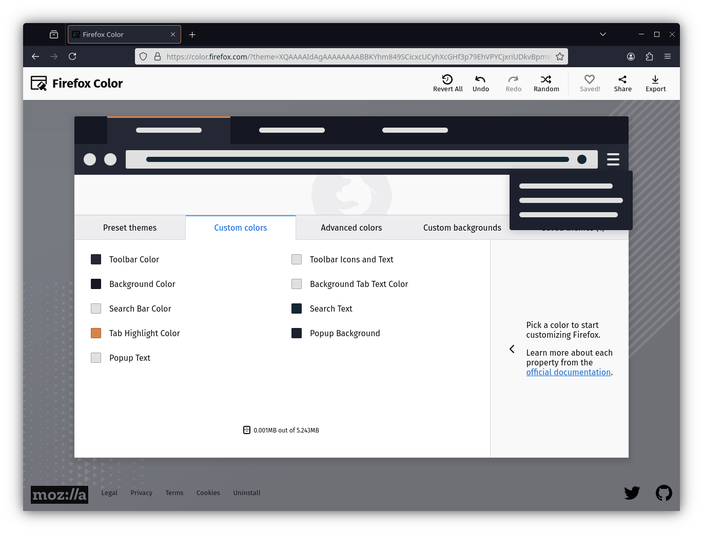

<h1 align="center">
	
     
	Emberstone for Firefox
</h1>

## Preview

## 🚧 Alpha Stage Notice

**Emberstone is currently in its ALPHA phase.** This means the themes are still in development, and we are actively iterating on design, color palettes, and compatibility. Contributions and feedback are highly appreciated as we work towards our first stable release.

## Requirement

This plugins have been tested on Firefox 128+ with [Firefox Color addon](https://addons.mozilla.org/en-US/firefox/addon/firefox-color/).

## Installation

Install the [Emberstone theme from Firefox Color](https://color.firefox.com/?theme=XQAAAAIdAgAAAAAAAABBKYhm849SCicxcUCyhXcGHf3p79EhVPYCjxriUDkvBpmWysCv-Zw_c6AMX8XmsFT6ZvGzVxOeQOJDmixrH4yoyzyyf2t1GI8PcxBpCJ0lR1t0dd5epoAhQOGbX4QIkEIogeDT4jRurIYpMdifdcpCygY6FgOaZ4zien4_gFlXNSQDAjKCZ4grjlcghkxS-om6nY6KJO7zi7xraMB-1mkaIPARmXSulsc6JEqEtuTXaA6rbBmwMxNkclE4YUD3Co6nxDDf2_sM1Yro6HUSq9SDUq_epxJ6uyfz7Zu51TYdtS5Ji3qSPvH9n6FW6ECwY6UHpHBQ_7jBCFZ3Z26yEG5JvXM_Mp8Lez3rh_4_krg9kme6dTe7F7c1AA7_8E6cuA).

  Distributed under the MIT License. © 2024 <a href="https://github.com/emberstone-theme">Emberstone Theme</a>

